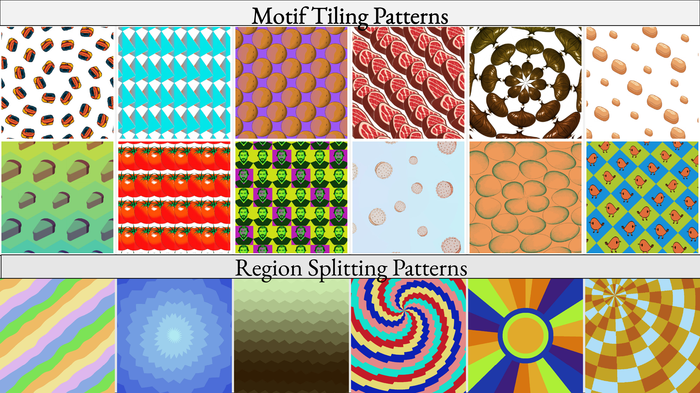
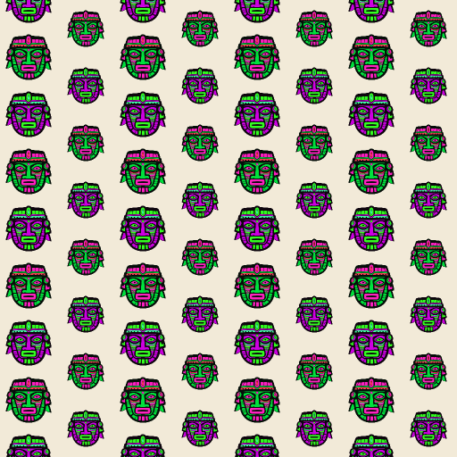
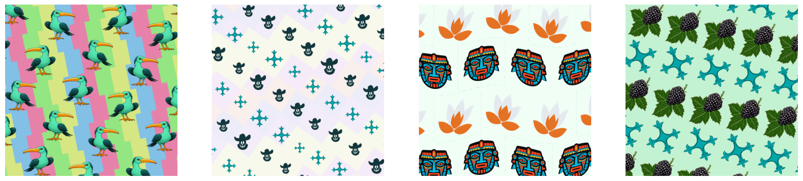
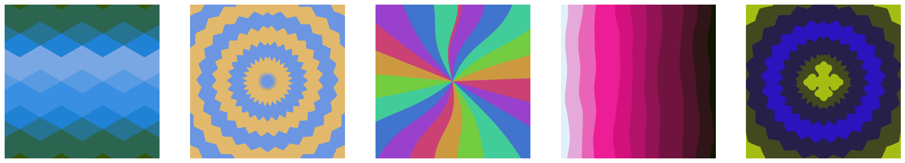
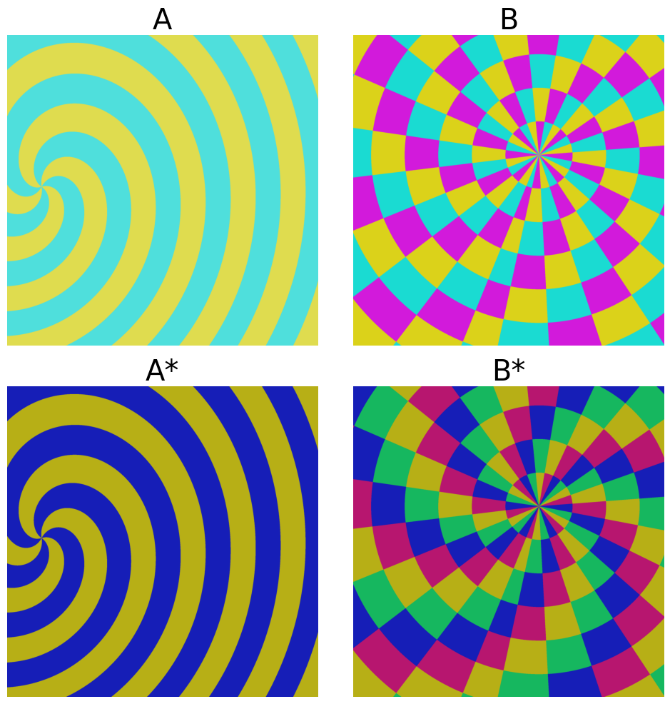
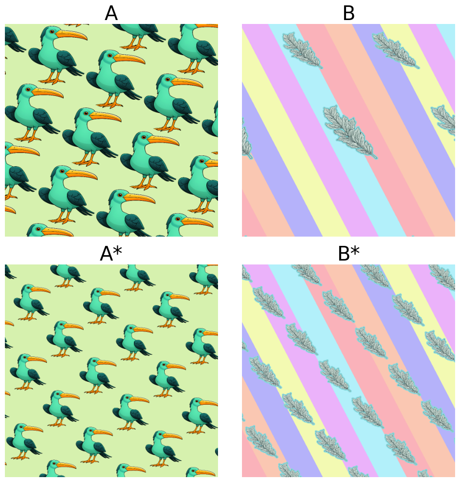
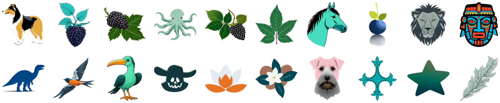

# SplitWeave

[](https://opensource.org/licenses/MIT)
[](https://www.python.org/downloads/)

**SplitWeave** is a DSL for 2D pattern programs. SplitWeave can be used to represent patterns built by **splitting** the canvas into fragments, applying fragment-index dependant modulations, and **weaving** them back together. We created this library to support the [Pattern Analogy](https://bardofcodes.github.io/patterns/) project (CVPR 2025). We used this tool to create synthetic analogical quartets to learn analogical editing of 2D pattern images. Please refer to the [paper](https://arxiv.org/abs/2412.12463) for more information.

This repository builds on [GeoLIPI](https://github.com/BardOfCodes/geolipi).

<p align="center">
  
</p>

#### Quick Notes: 

1. The language was mostly designed for sampling synthetic patterns. Therefore the design is not very user friendly. 

2. I plan to add a compiler to convert the pattern expressions into GLSL shader code. Then we can potentially evaluate expressions without GPUs :).

3. I used Claude Code to refactor the code base from the earlier version used for the paper submission. Please contact me (adityaganeshan@gmail.com) know if you need the original codebase. 

## What can you do with SplitWeave

### 1. Manually write and evaluate pattern programs.

Build expressions directly using `splitweave.symbolic` (`sws`) and evaluate with `grid_eval` or `evaluate_pattern_expr`.


```python
import torch as th
from PIL import Image
import numpy as np
import splitweave.symbolic as sws
import geolipi.symbolic as gls
import geolipi.symbolic.primitives_2d as prim2d
from geolipi.torch_compute import Sketcher
from splitweave.torch_compute import evaluate_pattern
RES = 512
DEVICE = "cuda" if th.cuda.is_available() else "cpu"
# Create sketcher to evaluate the expression
sketcher = Sketcher(device=DEVICE, resolution=RES, n_dims=2)

# Load tile
tile_path = "assets/tiles/etawvihr_1.png"
pil_img = Image.open(tile_path).convert("RGBA").rotate(90, expand=True)

tile_np = np.array(pil_img).astype("float32") / 255.0
tile = th.from_numpy(tile_np).to(DEVICE)

# Specify Layout
layout = sws.RectRepeatShiftedX(sws.CartesianGrid(), (0.25, 0.25), (0.125,))
# Layout-level cell effects
layout = sws.LayoutCellScale(
    layout, sws.YStripeSignal(2, True, True, False, False), 
    0.2, "single"
)
# Specify Tile
tile_expr = sws.TileRecolor(prim2d.TileUV2D(tile), 0.3)
tile_expr = sws.TileScale(tile_expr, 0.80)
tile_expr = sws.ApplyTile(layout, tile_expr)

# Specify some tile-level Cell Effects
cellfx_tile = sws.ApplyCellRecolor(tile_expr, 
    sws.XStripeSignal(2, False, False, False, False), "discrete",45, "single")

# Add some BG canvas
bg_color = th.tensor([0.95, 0.92, 0.85, 1.0], device=DEVICE)
bg = sws.ConstantBackground(bg_color)
root = gls.SourceOver(cellfx_tile, bg)
canvas, grid_ids = evaluate_pattern(root, sketcher, aa=2)
```

The `canvas` tensor has shape `[H*W, 4]` (RGBA). To visualise or save:

```python

#Evaluate the expression
canvas = canvas.reshape(RES, RES, 4).cpu().numpy()
canvas = (canvas * 255).astype(np.uint8)
image = Image.fromarray(canvas)
image.save("output.png")
```


<p align="center">
  
</p>

### 2. Generate Pattern Animations.

```python
# Extend imports from previous code snippets. 

def get_scaled_expr(tile, scale, translate):

    layout = sws.CartesianGrid()
    layout = sws.CartTranslate(layout,(translate, 0,))
    layout = sws.RectRepeatShiftedX(layout,
        (0.25, 0.25), (0.125,))
    # Layout-level cell effects
    layout = sws.LayoutCellScale(
        layout, sws.XStripeSignal(2, False, False, False, False, False), 
        scale, "single"
    )
    # Specify Tile
    tile_expr = sws.TileRecolor(prim2d.TileUV2D(tile), 0.3)
    tile_expr = sws.TileScale(tile_expr, 0.80)
    tile_expr = sws.ApplyTile(layout, tile_expr)

    # Specify some tile-level Cell Effects
    cellfx_tile = sws.ApplyCellRecolor(tile_expr, 
        sws.YStripeSignal(2, False, False, False, False, False), "discrete", 45, "single")

    # Add some BG canvas
    bg_color = th.tensor([0.95, 0.92, 0.85, 1.0], device=DEVICE)
    bg = sws.ConstantBackground(bg_color)
    root = gls.SourceOver(cellfx_tile, bg)
    return root

# fps = 30
# N = 4 sec
images = []
for i in range(120):
    scale_amount = np.sin(i/60 * 2 * np.pi) * 0.2
    translate_amount = i/60 * 0.5
    cur_expr = get_scaled_expr(tile, scale_amount, translate_amount)
    canvas, grid_ids = evaluate_pattern(cur_expr, sketcher, aa=2)
    canvas = canvas.reshape(RES, RES, 4).cpu().numpy()
    canvas = (canvas * 255).astype(np.uint8)
    image = Image.fromarray(canvas)
    images.append(image)

```

Save gif:
```python

from geolipi.utils import frames_to_animation
frames_to_animation(images,
    "output.gif",
    fps=30,
    format="gif",
    mp4_quality="high")
```


<p align="center">
  
</p>


### 3. Generate random Motif Tiling & Region Splitting Patterns.

#### MTP: Motif Tiling Patterns 

```python
import numpy as np
import torch as th
from PIL import Image
from geolipi.torch_compute import Sketcher
from splitweave.pattern_gen.mtp_main import sample_mtp_pattern
from splitweave.cfg_to_sw.parser import mtp_config_to_expr, load_tile_tensors_from_config
from splitweave.utils.tiles import get_tile_content
from splitweave.torch_compute import evaluate_pattern

# Fixed seed for reproducible random patterns
np.random.seed(9)
# 9 88 97
TILE_DIR = "../assets/tiles/"

RES = 1024
MID_RES = 256
DEVICE = "cuda" if th.cuda.is_available() else "cpu"
# Create sketcher to evaluate the expression
sketcher = Sketcher(device=DEVICE, resolution=RES, n_dims=2)

filenames, filename_to_indices = get_tile_content(TILE_DIR, mode=None)
mtp_cfg = sample_mtp_pattern(filenames, filename_to_indices, n_tiles=2)

tile_tensors = load_tile_tensors_from_config(mtp_cfg.tile_cfg, TILE_DIR, device=DEVICE)
expr = mtp_config_to_expr(mtp_cfg, tile_tensors=tile_tensors, device=DEVICE)
canvas, grid_ids = evaluate_pattern(expr.tensor(), sketcher, aa=2)

canvas = canvas.reshape(RES, RES, 4).cpu().numpy()
canvas = canvas[MID_RES:-MID_RES, MID_RES:-MID_RES]
canvas = (canvas * 255).astype(np.uint8)
image = Image.fromarray(canvas)
```

Here are random samples from the MTP Generator. 

<p align="center">
  
</p>

#### RSP: Region Splitting Patterns

```python
# Extend imports from previous
from splitweave.pattern_gen.rsp_main import sample_rsp_pattern
from splitweave.cfg_to_sw.parser import rsp_config_to_expr
from splitweave.utils.tiles import get_tile_content

# Fixed seed for reproducible random patterns
TILE_DIR = "../assets/tiles/"

RES = 1024
MID_RES = 256
DEVICE = "cuda" if th.cuda.is_available() else "cpu"
# Create sketcher to evaluate the expression
sketcher = Sketcher(device=DEVICE, resolution=RES, n_dims=2)

filenames, filename_to_indices = get_tile_content(TILE_DIR, mode=None)
rsp_cfg = sample_rsp_pattern(filenames, filename_to_indices)

tile_tensors = load_tile_tensors_from_config(rsp_cfg.tile_cfg, TILE_DIR, device=DEVICE)
expr = rsp_config_to_expr(rsp_cfg, tile_tensors=tile_tensors, device=DEVICE)
canvas, grid_ids = evaluate_pattern(expr.tensor(), sketcher, aa=2)

canvas = canvas.reshape(RES, RES, 4).cpu().numpy()
# canvas = canvas[MID_RES:-MID_RES, MID_RES:-MID_RES]
canvas = (canvas * 255).astype(np.uint8)
image = Image.fromarray(canvas)
```

Here are random samples from the RSP Generator. 

<p align="center">
  
</p>
### 4. Generate analogical quartets.

```python
# Analogy Sampler
import numpy as np
import torch as th
from PIL import Image
from geolipi.torch_compute import Sketcher
from splitweave.utils.tiles import get_tile_content
from splitweave.analogy_gen.mtp_layout_analogies import full_layout_change
from splitweave.cfg_to_sw.parser import mtp_config_to_expr, load_tile_tensors_from_config
from splitweave.torch_compute import evaluate_pattern

TILE_DIR = "../assets/tiles/"

RES = 1024
MID_RES = 256
DEVICE = "cuda" if th.cuda.is_available() else "cpu"
KEYS = ['patterns_a', 'patterns_b', 'patterns_a_star', 'patterns_b_star',]
# Create sketcher to evaluate the expression
sketcher = Sketcher(device=DEVICE, resolution=RES, n_dims=2)

filenames, filename_to_indices = get_tile_content(TILE_DIR, mode=None)
analogy_output = full_layout_change(filenames, filename_to_indices)
images = {}
for key in KEYS:
    cur_cfg = analogy_output[key][0]
    tile_tensors = load_tile_tensors_from_config(cur_cfg.tile_cfg, TILE_DIR, device=DEVICE)
    expr = mtp_config_to_expr(cur_cfg, tile_tensors=tile_tensors, device=DEVICE)
    canvas, grid_ids = evaluate_pattern(expr.tensor(), sketcher, aa=2)
    canvas = canvas.reshape(RES, RES, 4).cpu().numpy()
    canvas = canvas[MID_RES:-MID_RES, MID_RES:-MID_RES]
    canvas = (canvas * 255).astype(np.uint8)
    image = Image.fromarray(canvas)
    images[key] = image
```
| RSP Analogy | MTP Analogy |
|:-:|:-:|
|  |  |

### 5. Generate MTP pattern tiles

Tile generation uses [LayerDiffuse](https://github.com/lllyasviel/LayerDiffuse) and requires installing it separately (not included in splitweave's pip dependencies). Use `scripts/generate_tiles.py` to generate tile images via LayerDiffuse + SDXL. Here are some examples: 



#### Steps: 

##### 1. Create the word lists. 

Clone [corpora](https://github.com/dariusk/corpora) for word lists. Create a config as shown in `splitweave/configs/world_list_configs/` (it already contains some useful ones). Then run:

```bash
# run python scripts/build_noun_lists.py --config <path-to-config> --base-path <path-to-corpora/data>
# for example:
python scripts/build_noun_lists.py --config configs/word_list_configs/all_noun_lists.yaml --base-path ../../patterns/corpora/data/
```

##### 2. Create the tiles:

Clone [LayerDiffuse_DiffusersCLI](https://github.com/lllyasviel/LayerDiffuse_DiffusersCLI) and install its requirements. Create a config as shown in `splitweave/configs/tile_gen/` Then, run:

```bash
python scripts/generate_tiles.py --config configs/tile_gen/default.yaml 
```


### 6. Use the ASMBLR interface for Analogically editing pattern Images. 

TBD.

### Generate Analogical Quartet Training data: 

1. Create tiles. 
```python
python scripts/generate_tiles.py --config configs/tile_gen/default.yaml 
```
Adapt the script to generate over many different prompts. We generated 100_000 synthetic tiles for our experiments. 

2. Create analogical quartets. 

```bash
# python scripts/generate_analogical_quartets.py --tile_dir <path-to-tiles> --out_dir <path-to-save-imgs> 
python scripts/generate_analogical_quartets.py --tile_dir assets/tiles/ --out_dir  assets/synth_analogy/ --n_pats 10  --verbose
```


## Installation

### From source

```bash
git clone https://github.com/BardOfCodes/splitweave.git
cd splitweave

pip install -r requirements.txt
pip install -e .
```

You need [GeoLIPI](https://github.com/BardOfCodes/geolipi) installed (included in `requirements.txt`). For development (tests, linting):

```bash
pip install -e ".[dev]"
```

## Testing

From the repo root (with the package installed):

```bash
pytest
```

Some tests require **geolipi**. The bridge tests in `tests/test_patternator_bridge.py` use splitweave's pattern samplers and cfg_to_sw parser.

## License and disclaimer

MIT License. See [LICENSE](LICENSE). This is research code — use at your own risk.

## Related

- [GeoLIPI](https://github.com/BardOfCodes/geolipi) — DSL for implicit 2D/3D geometry (backend for SplitWeave)
- [SySL](https://github.com/BardOfCodes/sysl) — Symbolic scene language → GLSL/WebGL
